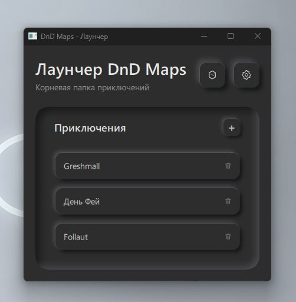
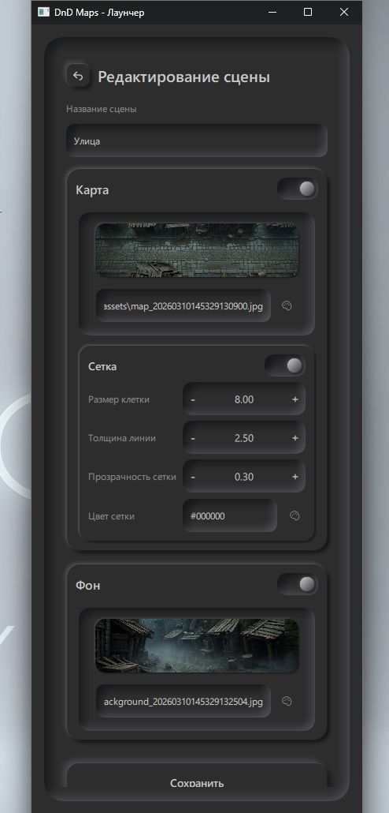
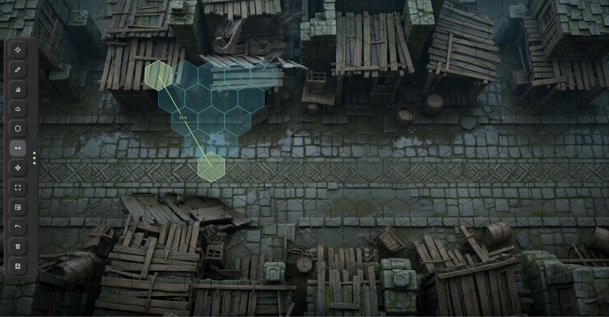
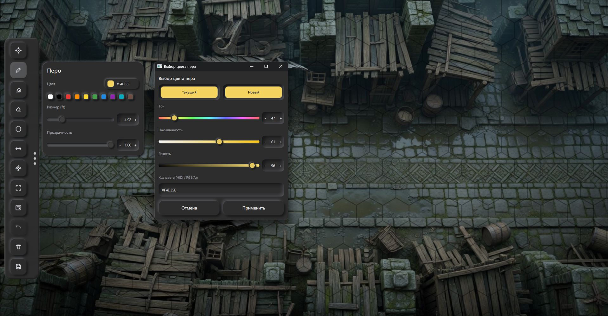
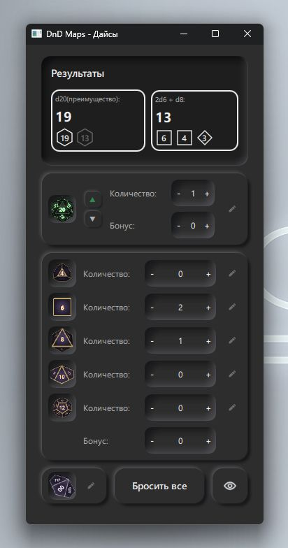
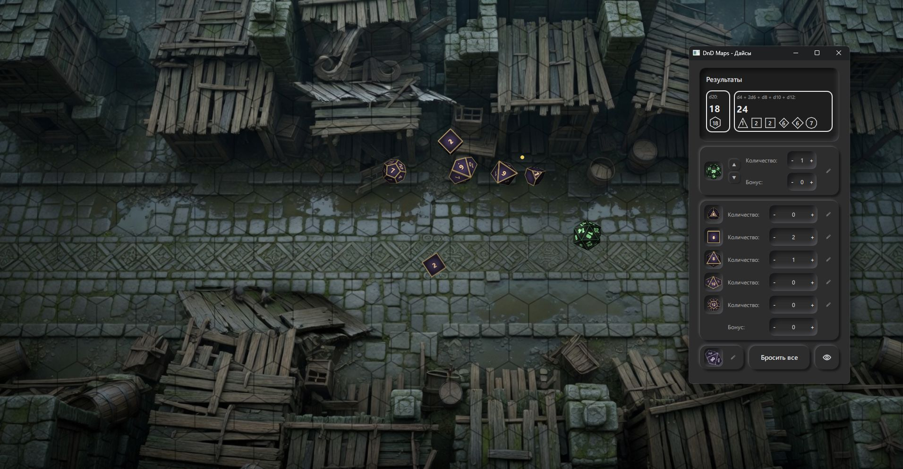
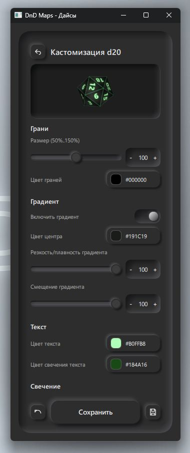
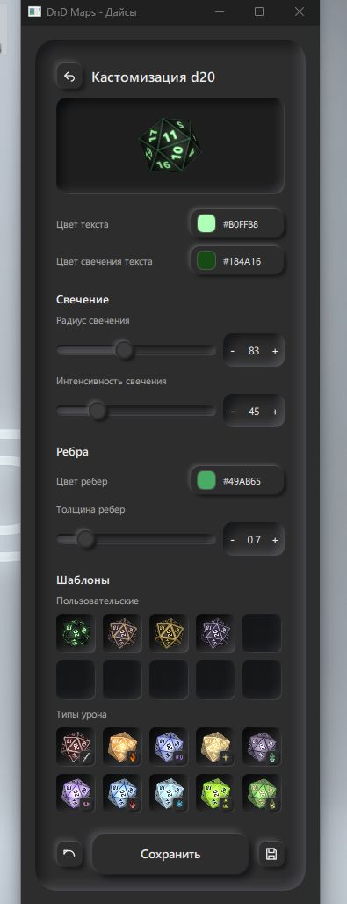

# MAPCASTER

MAPCASTER — десктопное Windows-приложение для мастера DnD.

Проект помогает управлять игровыми сценами во время сессии: открывать карты и фоны в отдельных окнах, рисовать поверх карты, измерять расстояния, управлять приключениями и выполнять броски 3D-дайсов.

MAPCASTER развивается как цифровая ширма мастера — единая локальная среда для подготовки сцен, отображения карт и игровых инструментов.

---

# Скриншоты

## Лаунчер



## Редактор сцены



## Карта с гексами и измерением расстояния



## Инструмент пера и выбор цвета



## Окно дайсов



## 3D-дайсы на карте



## Редактор стиля дайсов





---

# Основные возможности

* Управление приключениями и сценами
* Локальное файловое хранение проектов
* Отдельное окно карты для мастера
* Отдельное окно фона для игроков
* Поддержка изображений и видео
* Гексагональная сетка с настройкой параметров
* Инструменты рисования и редактирования карты
* Измерение расстояния по центрам гексов
* Система 3D-дайсов
* Закрытые броски для мастера
* Настройка внешнего вида дайсов
* Undo и очистка слоев
* Система шаблонов и стилей дайсов

---

# Архитектура проекта

Система разделена на несколько независимых компонентов.

## WindowManager

Отвечает за создание, управление и повторное использование окон приложения:

* launcher,
* map window,
* background window,
* dice window,
* dice roll window.

Окна не пересоздаются при каждой смене сцены, что упрощает работу во время игровой сессии.

## EventBus

Компоненты приложения взаимодействуют через внутреннюю event-driven систему.

```text
QML UI -> EventBus -> Python controllers/services -> filesystem storage
```

QML-интерфейс публикует события, Python-контроллеры обрабатывают бизнес-логику, а окна реагируют на изменение состояния приложения.

## Dice System

Подсистема дайсов включает:

* DiceService,
* DiceController,
* WebEngine renderer.

3D-визуализация дайсов выполняется через Qt WebEngine, а логика бросков и режимы отображения разделены между сервисами и контроллерами.

## Local Storage

Проект полностью работает локально и хранит данные в JSON-файлах.

Это упрощает:

* перенос проекта,
* резервное копирование,
* ручную диагностику данных.

---

# Используемые технологии

* Python 3.12
* PySide6 / Qt 6
* QML / Qt Quick Controls
* Qt Multimedia
* Qt WebEngine
* HTML / CSS / JavaScript
* JSON storage
* Git

---

# Основные окна

## Лаунчер

Главное окно проекта.

Позволяет:

* управлять приключениями,
* создавать сцены,
* настраивать карту,
* выбирать фон,
* управлять параметрами сетки.

## Окно карты

Основное рабочее пространство мастера.

Поддерживает:

* карту,
* гексагональную сетку,
* инструменты рисования,
* измерение расстояния,
* игровые пометки.

## Окно фона

Отдельное окно для игроков.

Отображает изображение или видео текущей сцены без интерфейса мастера.

## Окно дайсов

Модуль бросков с поддержкой:

* D4,
* D6,
* D8,
* D10,
* D12,
* D20,
* D100,
* advantage/disadvantage,
* визуальных стилей,
* различных режимов отображения бросков.

---

# Хранение данных

Проект хранит данные локально внутри рабочей папки.

## app_data/settings.json

Содержит:

* глобальные настройки,
* параметры UI,
* горячие клавиши,
* настройки дайсов,
* шаблоны стилей.

## adventures/<adventure>/adventure.json

Содержит:

* метаданные приключения,
* порядок сцен.

## adventures/<adventure>/<scene>/scene.json

Содержит:

* карту,
* фон,
* настройки сетки,
* слои рисования,
* выделения,
* данные сцены.

---

# Особенности проекта

## Многооконная архитектура

Приложение использует несколько независимых окон, что позволяет удобно работать во время игровой сессии.

## Локальная работа

Проект не требует сервера или облачных сервисов.

Все данные и сцены хранятся локально.

## Настраиваемые 3D-дайсы

Поддерживаются:

* кастомные цвета,
* градиенты,
* свечение текста,
* стили граней,
* шаблоны оформления.

## Неоморфный интерфейс

Интерфейс приведен к единому темному неоморфному стилю. В проекте используются переиспользуемые QML-компоненты для raised/inset-поверхностей, кнопок, переключателей, слайдеров со степперами и окон выбора цвета.

## Разделение логики и визуализации

Логика бросков, состояние окон и визуальный рендер разделены между сервисами, контроллерами, QML и WebEngine-слоем. Это позволяет отдельно развивать механику бросков, UI и 3D-визуализацию.

---

# Планы развития

* Документ приключения — окно для просмотра и редактирования заметок кампании, описаний сцен, NPC и сюжетных материалов.
* Боевой трекер — окно боевой сцены с карточками персонажей и противников, инициативой, состояниями, HP, AC и ключевыми статами.
* Интеграция AI-ассистента мастера — отдельный агент со справочной базой знаний DnD уже находится в активной разработке в соседнем репозитории.

---

# Запуск проекта

## Требования

* Windows
* Python 3.12

## Запуск из исходников

```bash
python -m app.main
```

Альтернативные варианты:

```bash
py -3 -m app.main
run_dnd_maps.bat
```

После установки как Python-пакета:

```bash
dnd-maps
```

---

# Статус проекта

Проект находится в активной разработке.

Реализованы:

* управление приключениями и сценами,
* редактор сцены,
* карта с инструментами,
* окно фона,
* модуль дайсов,
* стилизация дайсов,
* 3D-броски.

